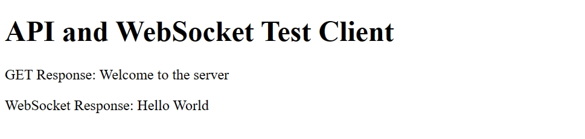
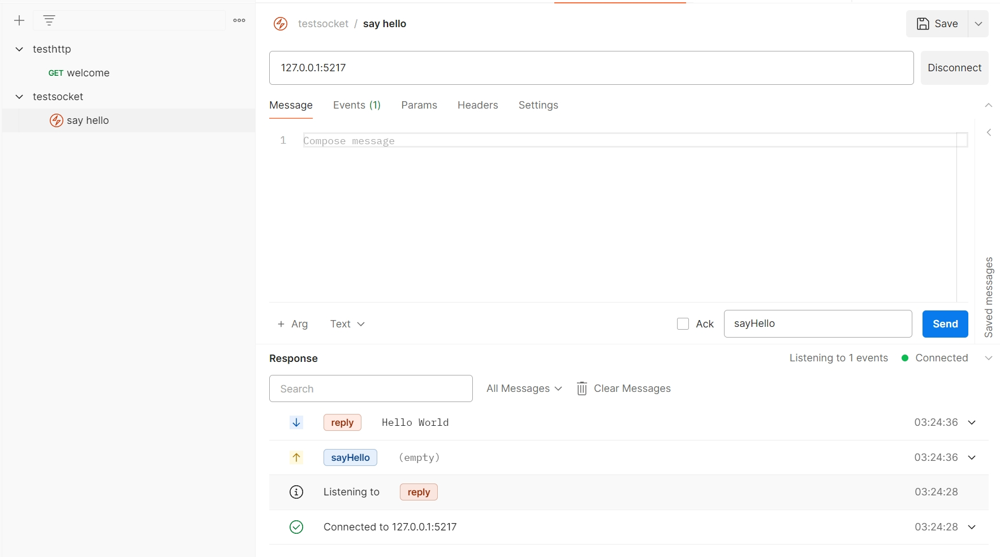

# Simple Deployment With Kubernetes

Super simple backend node.js server + mongo deployment with Kubernetes & Minikube

- Support basic GET 
- Also support socket.IO

## Configuration

One pod with two containers, one for node app, one for mongodb

Use minikube to run the pod, also expose the service to local access

The app listen to port 8228, which get exposed to 30007 using Kubernetes NodePort Service

## Try it yourself

(optional) compile the docker image

```
docker build -t <whatever name, but don't forget to update kube yaml> .
```

open up minikube

```
minikube start
```

deploy the pods and the service, in the `service.yaml`, I use the `NodePort` type with `nodeport=30007`

```
kubectl apply -f kube-deployment.yaml
kubectl apply -f kube-service.yaml
```

**IMPORTANT: you have to somehow tunnel your minikube IP to a local address to test your service locally**

```
minikube service simple-backend-app-service
```

You will see things like below, your traffic to localhost will be forwarded to `<minikube ip>:nodeport`.

```
|-----------|----------------------------|-------------|---------------------------|
| NAMESPACE |            NAME            | TARGET PORT |            URL            |
|-----------|----------------------------|-------------|---------------------------|
| default   | simple-backend-app-service |        8228 | http://192.168.49.2:30007 |
|-----------|----------------------------|-------------|---------------------------|
🏃  Starting tunnel for service simple-backend-app-service.
|-----------|----------------------------|-------------|-----------------------|
| NAMESPACE |            NAME            | TARGET PORT |          URL          |
|-----------|----------------------------|-------------|-----------------------|
| default   | simple-backend-app-service |             | http://127.0.0.1:5217 |
|-----------|----------------------------|-------------|-----------------------|
🎉  Opening service default/simple-backend-app-service in default browser...    
❗  Because you are using a Docker driver on windows, the terminal needs to be open to run it.
```

## See the outcome

Then open up the file `testbackend.html` in your browser, you will see one response from GET, one response from socket event `sayHello`.

Here is what you will see:



You can also use **Postman**:

